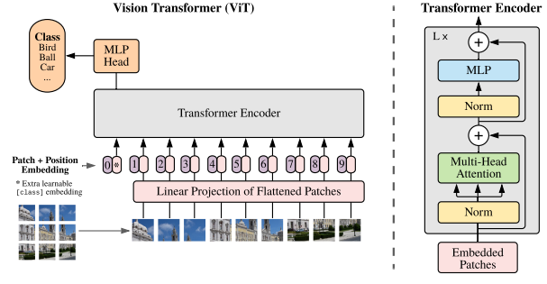
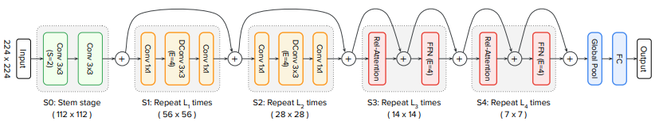
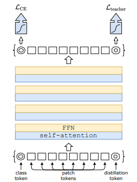

## Vision Transformer
  
* 입력 영상 16 * 16으로 patch화 후, 각 patch는 embedding화 (384 * 384 * 3 -> 576 * 768=768정보량의576토큰)  
* class token concat 후(576+1 * 768) position embedding 더하기.  
  - class token = total 정보 그릇으로 특정 패치와 무관하기 위해, 학습변수  
  - position embedding = 토큰 별 다른 정보로 결국 위치정보를 담을수밖에, 학습변수  
* 12개의 Block으로 구성된 Encoder를 거치고 class token만 MLP_Head(FC)로.  
  - Block은 LayerNorm,Multi-HeadAttention,MLP로 구성.  

* *Block 보면, MLP로 Conv와 같이 패치 내 feature 추정이 가능 MHA로 타 패치 정보 전달(비교, 가중, 등) 가능*  
* *그러면, 뭔가 Croped CNN? input으로 만든 weight? non-local 개념?*  
> "An Image is Worth 16x16 Words: Transformers for Image Recognition at Scale," ICLR 2021.

-------------------------------------------------------
 

## CoAtNet
  
* Conv의 장점 (local pattern, translate independent)과 Attention (global receptive, high capacity)을 다음 기준으로 합성.  
  1. conv와 attn을 한 block에 조합하기.  
  2. 어떤 타입의 block으로 네트워크를 쌓을지.  
* attention 과정의 softmax 전에 (input-independent) global kernel을 더해 conv와 같은 rel-attn 제안.  
  * 기존 Attn과 Rel-Attn을 비교하면 성능 향상 확인.
* Stage 별 conv-block과 attn-block을 조합해 실험해본 결과 Stem(conv)-C-C-T-T 구조 선택.  
  * 일반화 성능 (train과 eval간의 gap): ImageNet-1K 학습 시 conv가 많을수록 성능 좋음.  
  * Capacity (모델의 수용능력) : JFT로 학습 시 적절한 Conv와 attn이 섞여야 좋은 (C-C-T-T or C-T-T-T)  

* *rel-Attn 성능확인 빈약해보임.. wieght 늘렸으니까 당연 더 잘대겠지*  
* *조합방법? search space?가 약해보임. 근거도 실험밖에 없는 것두*  
> "CoAtNet: Marrying Convolution and Attention for All Data Sizes," Arxiv 2021.  

-------------------------------------------------------
 

## Deit
  
* ViT + Knowledge Distillation + Bag of tricks  
  * Teacher token을 만들어서 RegNet을 teacher model로 KD 수행.  
  * CNN 모델들에서 사용하는 data argumentation 이라던지, 학습 기법들 적용.  
* inference 때 class token과 teacher token을 더하거나 concat해서 사용.  
* ViT처럼 big data로 pre-training 없어도 잘나옴.

* *왜 KD과정이 마지막 teacher token에서만 하지? 중간 중간 하면 안대나?*
* *CNN에서 쓰던거 더했더니 CNN처럼 Inductive biases가 생긴다? 이게 맞나?*  
> "https://arxiv.org/pdf/2012.12877.pdf," Arxiv 2021.  

-------------------------------------------------------
 