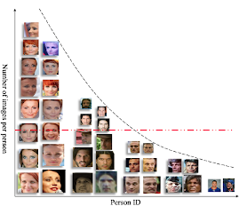
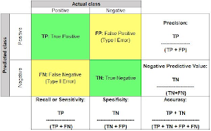

## Long Tail Distribution
  
sample이 많은 class에 overfitting, 적은 class는 학습 잘안댐.  
=Class imabalance problem  
> "Range Loss for Deep Face Recognition with Long-tail," ICCV 2017.  

-------------------------------------------------------
 

## Classficiation Measure
  
> https://www.analyticsvidhya.com/blog  

-------------------------------------------------------
 

