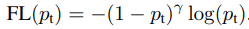

## Focal Loss  Focal Loss  
  
* loss에 predict probability 기반 weight.  
* easy sample 영향 낮추고 hard sample 고려하도록  
> "Focal Loss for Dense Object Detection," ICCV 2017.  

-------------------------------------------------------
 

## Class Balanced Loss
  
* 데이터 간의 유의미한 정보가 중복, 이를 고려하여 class 별 유의미한 양의 역수를 weight로 사용.  
  * Effective Number(전체 양(N) 대비 몇장(n)을 뽑았을 때 유효한 장 수의 기대치)의 역수를 weight로 사용.  
  * 각 클래스별 Effective Number는 클래스 set이 가질 수 있는 유효한 정보량이며 이는 샘플 수에 해당. 
   
   
* *결과론적으로, 클래스 샘플 수에 반비례한 weight를 주는데, 일정 비율 이상일때 너무 낮은 weight를 주지않기 위해서인듯.*  
> "Class-Balanced Loss Based on Effective Number of Samples," CVPR 2019.  

-------------------------------------------------------
 

## Seesaw Loss
  
* long tail (class imbalance) 문제 해결 방안, loss에 2가지 factor 적용.  
  * Mitigation Factor: instance number of classs의 비율 만큼 weight 적용.  
  * Compensation Factor: 많이 틀린 부분에 대해서 weight 적용.  
* 두 factor를 곱하여 weight로 사용하며, loss 보단 gradient에 직접적인 영향.  

* *Compensation Factor가 항상 샘플 많은 class에 유리한가? 그래야 보상개념인디, 아니면 Focal이랑 비슷한디*
> "Seesaw Loss for Long-Tailed Instance Segmentation," CVPR 2021.  

-------------------------------------------------------
 
