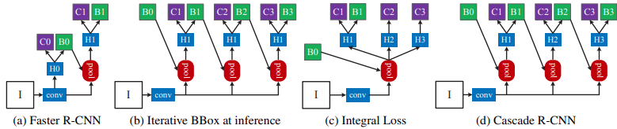
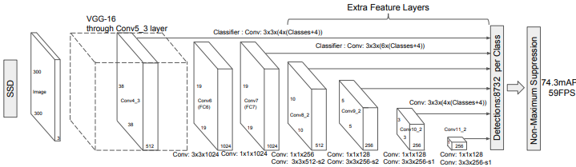

## RCNN, FastRCNN, FasterRCNN
Regions with CNN, Detector (classficiation + localization(box))  
RCNN: region estimation -> image crop by region -> CNN per regions = class, box  
FastRCNN: Feature Extraction -> region proposal (Selective search) -> RoI -> FCs  
FasterRCNN: Feature Extraction -> region proposal Net(RPN) -> ROI -> FCs  
> "Rich feature hierarchies for accurate object detection and semantic segmentation,"  
> "Fast R-CNN,"  
> "Faster R-CNN: Towards Real-Time Object Detection with Region Proposal Networks,"  

-------------------------------------------------------
 

## Casecade RCNN
  
RPN에서 추정된 box를 positive인지 결정하는 hyadaddperparameter IoU에 따라 FN, FP 성능 결정.  
초반엔 낮은 IoU로 대략? 찾고 점점 높은 IoU로 정확히 찾는 방향의 일종의 classifier ensemble.  
> "Cascade R-CNN: Delving Into High Quality Object Detection," CVPR 2018.  

-------------------------------------------------------
 

## Single Shot Detector (SSD)
  
Body의 각 stage별 feature maps에 독립적으로 head 사용, 결과 NMS.
Head는 anchor box 추정, box regression, classification으로 구성.  
stage 별 feature map을 추정했기에 anchor에 scale을 제외한 ratio로 구성.  
> "SSD: Single Shot MultiBox Detector," ECCV 2016.  

-------------------------------------------------------
 

## CenterNet
Upload Soon.  
> "".  

-------------------------------------------------------
 

## FCOS
Upload Soon.  
> "".  

-------------------------------------------------------
 

