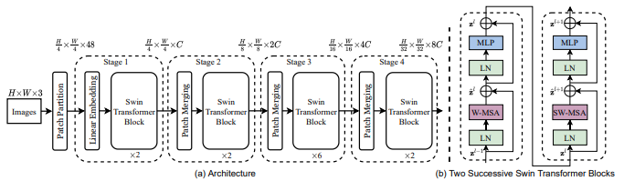

## RCNN, FastRCNN, FasterRCNN
* Regions with CNN, Detector (classficiation + localization(box))  
* RCNN: region estimation -> image crop by region -> CNN per regions = class, box  
* FastRCNN: Feature Extraction -> region proposal (Selective search) -> RoIpooling -> FCs  
* FasterRCNN: Feature Extraction -> region proposal Net(RPN) -> ROIpooling -> FCs  
> "Rich feature hierarchies for accurate object detection and semantic segmentation,"  
> "Fast R-CNN,"  
> "Faster R-CNN: Towards Real-Time Object Detection with Region Proposal Networks,"  

-------------------------------------------------------
 

## Casecade RCNN
  
* RPN에서 추정된 box를 positive인지 결정하는 hyadaddperparameter IoU에 따라 FN, FP 성능 결정.  
* 초반엔 낮은 IoU로 대략? 찾고 점점 높은 IoU로 정확히 찾는 방향의 일종의 classifier ensemble.  
> "Cascade R-CNN: Delving Into High Quality Object Detection," CVPR 2018.  

-------------------------------------------------------
 

## Single Shot Detector (SSD)
  
* Body의 각 stage별 feature maps에 독립적으로 head 사용, 결과 NMS.
  * Head는 anchor box 추정, box regression, classification으로 구성.  
  * stage 별 feature map을 추정했기에 anchor에 scale을 제외한 ratio로 구성.  
> "SSD: Single Shot MultiBox Detector," ECCV 2016.  

-------------------------------------------------------
 

## Swin Transformer
  
* Transformer의 OD version.  
  * patch간 attn을 windows 내에서 수행한다라는 개념을 도입하여 기존 CNN body처럼 계층적인 구조를 가짐.
  * 계층구조라 연산량 감소 효과 및 FPN과 같은 장점 가짐.  
* Patch Partition, Merging, Linear, SwinTranformer Block(W-MSA, SW-MSA)으로 구성.  
  * Patch Partition/Merging은 영상 패치화, 패치를 묶어 큰 패치화(for계층).  
  * W-MSA: patch간 attn에서 대상이 전체 영상이 아닌 window내 패치간 작용.  
  * SW-MSA: window 때문에 특정 patch간만 반복적으로 attn이 이루어지는 문제해결코자, 
  window를 0.5씩 움직여 비교 patch 군 재설정.  
* 기존 position embedding을 Softmax(Attn) 이전 상대 좌표 값을 더하는 것으로 대체.  
  
> "Swin Transformer: Hierarchical Vision Transformer using Shifted Windows", 2021.  

-------------------------------------------------------
 

