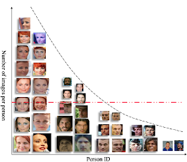

### Long Tail Distribution
  
sample이 많은 class에 overfitting, 적은 class는 학습 잘안댐.  
=Class imabalance problem  

-------------------------------------------------------

### Classficiation Measure
Confusion Matrix  
sample이 많은 class에 overfitting, 적은 class는 학습 잘안댐.  

-------------------------------------------------------
