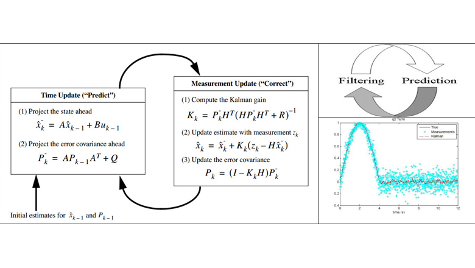
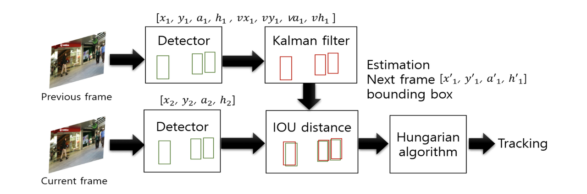
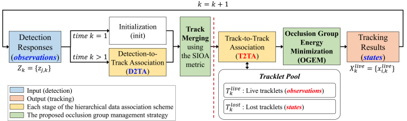

## Kalman Filtering
  
* 이전 상태값으로 현 상태값을 예측.  
  * x=상태, A=상태2상태전이행렬, B=입력2상태전이행렬, 원래 노이즈 더함.  
  * P=오차공분산, Q=예노이즈  
  * 즉, 예측값은 과거값에 변화량을 곱하고 사용자입력값(ex. 힘,카메라 변화,등)을 더해 구함.  
  * 오차공분산은 상태 변화량이 커질수록, 노이즈가 커질수록 커짐.  
* 칼만게인을 구해 현상태, 현 공분산 보정.  
  * K=칼만게인, H=상태2예측행렬, R=관측노이즈  
  * 칼만게인은 P에 비례, R에 반비례(노이즈가 클수록 K값 0, 작을수록 H)=관측에대한신뢰도  
  * 칼만게인을 weight로 현상태 구함. 동일하게 오차공분산도 보정.  
> "https://www.eiva.com/about/eiva-log/how-navisuites-kalman-filter-ensures-precise-subsea-positioning"  

-------------------------------------------------------
 

## SORT  
  
* 그림이 전부  
* Box 정보를 사용한 Kalman filter + hungarian matching  

> "Simple online and realtime tracking," ICIP 2016.  
> "Towards Real-time Multi-object Tracking in CPU Environment," 방송공학회논문지 2020.  
-------------------------------------------------------
 

## GMPHD-OGM  
  
* 기존 GMPHD는 Gaussian Mixture Model 기반 Tracking (D2TA).  
  * 기본 틀은 Kalman Filter인데, 다중 객체를 고려, 각 객체를 gaussian modeling.  
  * 관측값이 들어오면 gaussian mixture update, weight로 모든 gaussian model 고려.  
  * 즉, 기존 kalman이 1대1이면 GMPHD은 1대다를 가정하여 업데이트.  
* 그런데, 관측값을 보정하지 tracker에 대한 예측이 별도로 필요 (T2TA).  
  * 위에서 사용한 weight(obs-tracker)를 cost로 hungarian matching.  
  * matching 안된 tracker는 가지고 가면서 예측값을 사용.  
* SIOA로 중복 tracker 삭제(TrackMerging).  
* Gaussian Model의 energy를 계산해서 장애물에 가려져 미검출되는 객체를 살림.(OGEM)  
> "Online Multi-Object Tracking Framework with the GMPHD Filter and Occlusion Group Management," Arxiv 2019.  

-------------------------------------------------------
 

